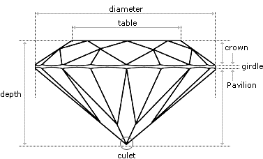

# Diamonds
## Источник
https://www.kaggle.com/shivam2503/diamonds
## Датасет
Данные содержат информацию о 54000 алмазах: их цены и параметры.
### Задача
Необходимо по заданным параметрам предсказать стоимость алмаза (задача регрессии).
### Описание данных
1. Price - цена в долларах, вещественный признак;
2. Carat - вес алмаза, вещественный признкак;  
3. Cut - огранка алмаза, категориальный признак;
4. Color - цвет алмаза, категориальный признак;
5. Clarity - насколько чист алмаза, категориальный признак;
6. X - длина алмаза, вещественный;
7. Y - ширина алмаза, вещественный;
8. Z - глубина алмаза, вещественный;
9. Depth - 2 * z / (x + y), вещественный;
10. Table - ширина самой верхней грани, вещественный (для более подробной информации см. рисунок ниже).
### Структура алмаза
